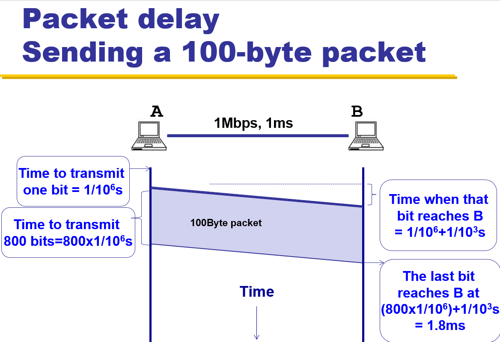

# 1 Intro and Overview
[Branch: 0 Intro](/notes/0%20Intro.md)
||
[Branch: 2 Layering](/notes/2%20Layering.md)
## TA contact

Dayou Zhang (张大猷): 221019044@link.cuhk.edu.cn

Boxiang Zhu (朱伯湘): 222010011@link.cuhk.edu.cn

Panlong Wu (吴攀龙): 222010016@link.cuhk.edu.cn

## Grading 

<table bgcolor = NavajoWhite>
<tr>
    <td>Assignment: 20% + 5% + 15% = 40% (May have bonus)
<tr>
    <td>Quiz/ Attendance: 5%
<tr>
    <td>Final 35%
</table>

<table bgcolor = NavajoWhite>
<tr>
    <td>Assignment1: 
    <td>measure end-to-end throughput and delay of networks (i.e., simple speed test)
<tr>
    <td>Assignment2: 
    <td>video streaming from CDNs (i.e., simple Netflix)
<tr>
    <td>Assignment3:
    <td>reliable transport (i.e., how to transfer data over an unreliable network)
<tr>
    <td>All on (emulated) realistic networks using mininet
    <td>
</table>

## Two ways to share switched networks 

<table bgcolor = NavajoWhite>
<tr> 
    <td >circuit switching 
    <td>simple and fast
    <td>switch fails == all fail; extremely inefficient
<tr>
    <td>packet switching 
    <td>efficient & Simpler
    <td>requires buffer
</table>

## Performance metrics 

<table bgcolor = NavajoWhite>
<tr> 
    <td><b> Category </b>
    <td><b> Sub-Category </b>
    <td><b> Definition </b>
    <td><b> Note </b>
<tr> 
    <td rowspan="6"> Delay
<tr> 
    <td>Transmission Delay 
    <td>Time for a packet to move into the link 
    <td rowspan="2">determined by link only 
<tr> 
    <td>Propagation Delay 
    <td>Time for one bit to move through the link 
<tr> 
    <td>Queuing Delay
    <td>Time for a packet to stay in a queue/buffer
    <td>depend on traffic
<tr> 
    <td>Processing Delay
    <td>Time for a switch to process a packet (negligible)
    <td>traffic and switch itself
<tr>
    <td>Round Trip Time
    <td>Time for a packet to go from a source to a destination and to come back
    <td>RTT/2 equals average end-to-end delay

<tr>
    <td> Loss
    <td>
    <td>What fraction of the packets sent to a destination are dropped?
    <td>

<tr>    
    <td rowspan="3"> Throughput
    <td> Throughput in a link
    <td>At what rate is the destination receiving data from the source?
    <td> 
<tr>    
    <td> End-to-End Throughput
    <td>Same Definition but..
    <td> min{R1, R2, ... Rn}, 木桶短板效应
</table>

<b>Transmission delay </b>= Packet size / Transmission rate of the link 

$\text{e.g. } TD = {1000 bits} / {(100 Mb/s)} = 10^{-5}s$

<b> Propagation delay </b>= Link length /Propagation speed of link （默认是光速）

$\text{e.g. } PD = {30 km} / {(3*10^8 km/s)} = 10^{-4}s$

例题：

Link with 1Mbps, 1ms  
Packet delay = Transmission delay + Propagation delay = 
${30 km} / {(3*10^8 km/s)} = 10^{-4}s$

<b> Propagation delay </b> (no fomula)  
the time that a packet stays in a queue (buffer)

<b> Throughput </b>

例题: 
Link with Transmission rate R bits/s  
File of F bits; Packet of L bits

Transfer time $T = F/R + \text{probagation delay}$  
Average throughput $R \approx F/T$

<b> End-to-End Throughput </b>

例题: 
$Link_1$ with Transmission rate $R_1$ bits/s  
$Link_2$ with Transmission rate $R_2$ bits/s  

Average throughput $R = min\{R_1, R_2\}$

