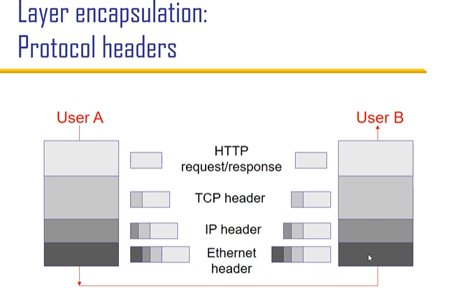
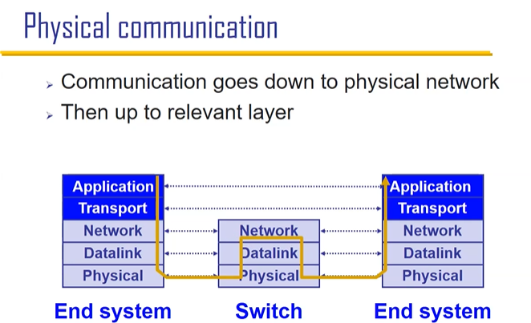

# 2 Layering
[Branch: 1 Intro and Overview](/notes/1%20Intro%20and%20Overview.md)
||
[Branch: 3 Socket and HTTP](/notes/3%20Socket%20and%20HTTP.md)

## 小知识

DNS: 域名系统 converting website name like <b>google</b> to IP <b>xxx.yyy.zzz.abc</b>

## Layers 

3 steps: Decompose, organise, assign

<table bgcolor = NavajoWhite>
<tr>
    <td>Layer
    <td>Layer Name
    <td>e.g.
<tr>
    <td>L7
    <td>Application 
    <td>SMTP HTTP DNS NTP
<tr>
    <td>L4
    <td>Transmition 
    <td>TCP UDP
<tr>
    <td>L3
    <td>Network (global delivery) 
    <td>IP
<tr>
    <td>L2
    <td>Data-link (local delivery) 
    <td>Ethernet SONET FDDI PPP
<tr>
    <td>L1
    <td>Physical transfer of bits 
    <td>Optical Copper Radio PSTN
</table>

ways of communication between the same layer is defined by <b>protocals</b> 
<b>protocals</b> is the most important thing in the course

## Communication Perspective 
Communication between layers: adding a header every time it goes deeper.

### From a host Perspective

A switch contains L1 L2 L3 
A host has 5 layers 

Switch vs Router  
Switch 交换机 L1 L2  
Router 路由器 L1 L2 L3  
won't focus on their difference

 
每次传输会先解析到network再进行下一步传输(intuitive)

## Context and Dilemma
e.g. IP: Too many people using it, so from IPv4 to IPv6.  
IPv6 still needs to be compatible with v4 (not many people tend to transport to it).

