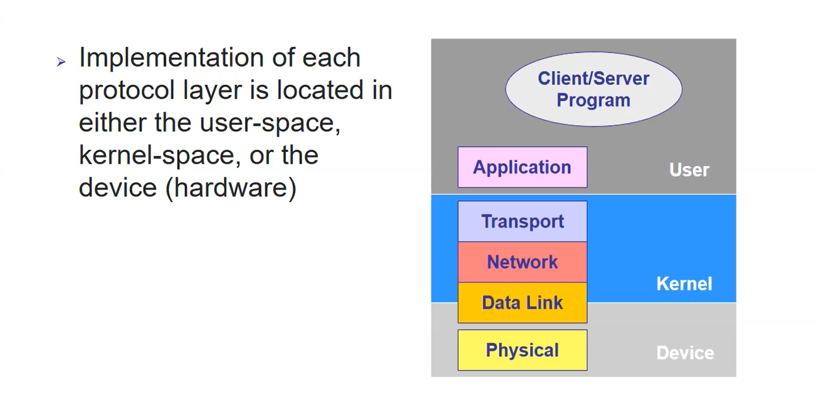
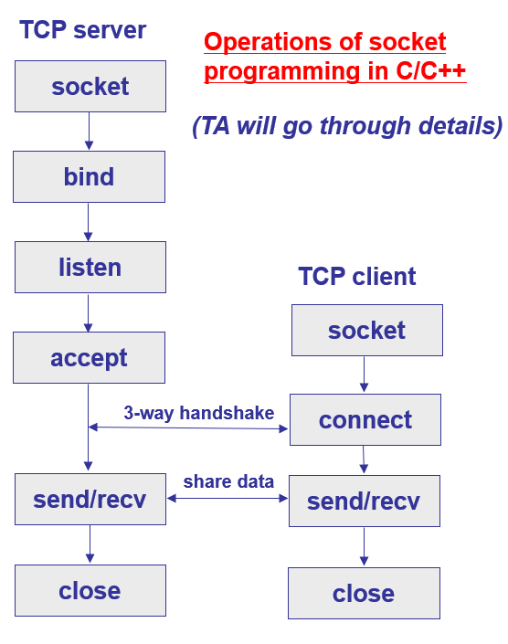
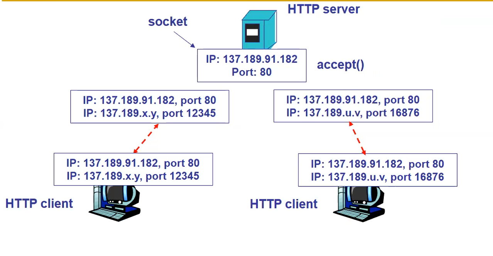
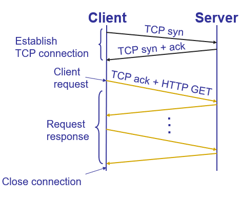

# 3 Socket and HTTP
[Branch: 2 Layering](/notes/2%20Layering.md)
||
[Branch: 4 CDN DNS]()

## 1. Layer Review

## 2. Socket
### 2.1 Definition
Most programming are for application layer stuff. For inter-app communication, people need network programming. 
Socket: the simplest interface between App and Trans. It is a <b>host-local</b>, <b>application-created</b>, <b>OS-controlled</b> interface (a “door”) into which application process can both send and receive messages to/from another application process

<b>One socket is tied to one application process (or thread). </b>An application can create many processes (and hence sockets)

### 2.2 Socket programming using TCP

TCP service: reliable transfer of bytes from one process to another.  
An application may view TCP as a reliable queue structure.

    Process:
    
    Before Client contacts Server:
        1. server process must first be running
        2. server must have created socket (door) that welcomes client’s contact

    Client contacts server by: 
        1. creating client-local TCP socket
        2. specifying IP address, port number of server process
        3. when client creates socket: client TCP establishes connection to server TCP

    When contacted by client,:
        server creates new TCP socket for server process to communicate with client
        so: allows server to talk with multiple clients
        and: source port numbers used to distinguish clients

The process of TCP socket 
Other content neglected

## 3 Socket's Addressing Process
IP + port number 
e.g.  
HTTP server: 80 
Mail server: 25 
To send HTTP message to sse.cuhk.edu.cn web server:  
IP address: 137.189.91.182; Port number: 80

### 3.1 Illustrations

HTTP server uses fixed port number (80) 
while HTTP client can use self-defined ones

## 4 Web Components

Clients and Servers 
URL & HTML 
Protocol of Info trsansmittion

## 4.1 URL
URL: 
Protocol://host_name[:port]/directory_path/resource  
e.g.: https://github.com/HuaichenOvO/ECE4016_note_hw_

<b>Protocol</b> includes http, ftp, smtp, etc 
<b>Host_name</b> can be a DNS name or an IP address 
<b>port</b> e.g. http:80, https:443 
<b>dir_path</b> follows that of the file system 
<b>resource</b> files/other Info

## 4.2 HTTP Protocol

Process

APIs:
GET, HEAD, PUT, DELETE
