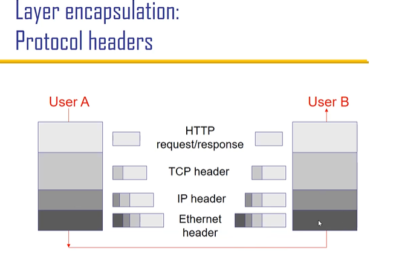

# 2 Layering
[上一章](/notes/CPT1.md)
[下一章](/notes/CPT2.md)

## 小知识

DNS: 域名系统 converting website name like <b>google</b> to IP <b>xxx.yyy.zzz.abc</b>

## Layers 

3 steps: Decompose, organise, assign

<table bgcolor = NavajoWhite>
<tr>
    <td>L7
    <td>Application 
    <td>SMTP HTTP DNS NTP
<tr>
    <td>L4
    <td>Transmition 
    <td>TCP UDP
<tr>
    <td>L3
    <td>Network (global delivery) 
    <td>IP
<tr>
    <td>L2
    <td>Data-link (local delivery) 
    <td>Ethernet FDDI PPP
<tr>
    <td>L1
    <td>Physical transfer of bits 
    <td>Optical Copper Radio PSTN
</table>

ways of communication between the same layer is defined by <b>protocals</b> 
<b>protocals</b> is the most important thing in the course

不同层间传输：层层加前缀

